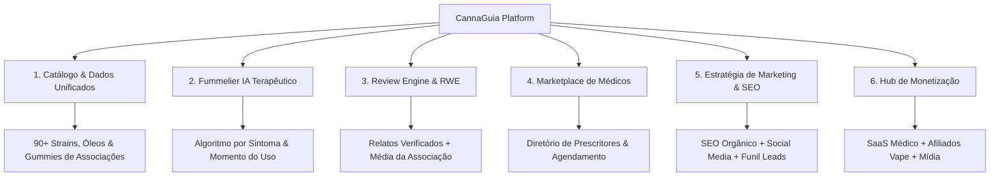
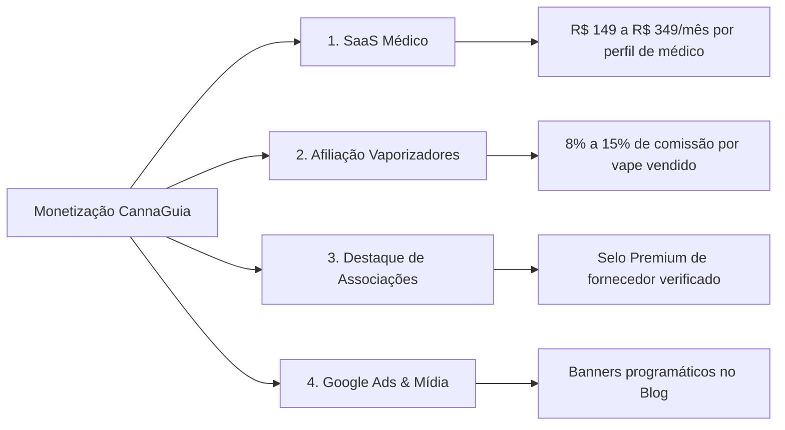
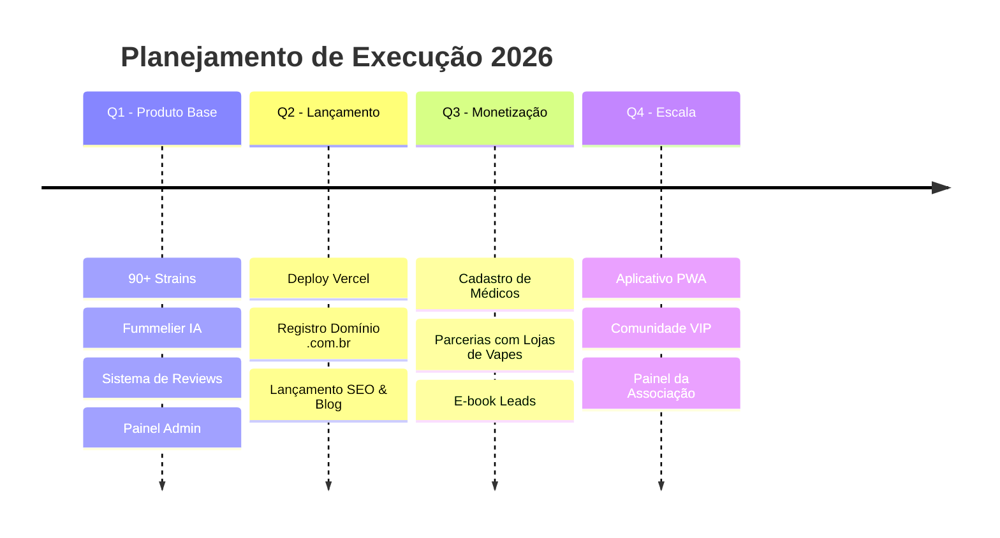

# 🌿 Plano Estratégico, Marketing & Modelo de Negócio — CannaGuia

O **CannaGuia** é a **maior plataforma brasileira de inteligência, avaliação e conexão no ecossistema de Cannabis Medicinal**, unindo Pacientes, Associações, Médicos Prescritores e Marcas Especializadas.

---

## 🎯 1. Visão Geral do Ecossistema CannaGuia

---

## 🚀 2. Estratégia Completa de Marketing & Tração de Pacientes (Go-To-Market)

Para escalar o CannaGuia e tornar o site a **referência #1 de consulta de cannabis medicinal no Brasil**, a estratégia de marketing é dividida em 5 pilares de tração:

### 🔍 Pilar 1: SEO Terapêutico de Alta Intenção (Inbound Marketing)
* **Objetivo:** Capturar o tráfego de busca do Google de pessoas que já possuem receita ou estão buscando tratamento.
* **Estratégia de Conteúdo:**
  * **Páginas de Strains Ranquedas:** Criar URLs amigáveis e otimizadas para cada flor e produto (ex: `cannaguia.com.br/strains/24k-gold`, `cannaguia.com.br/oleos/cbd-full-spectrum-3000mg`).
  * **Artigos de Solução de Dores (Long-tail Keywords):**
    * *"Qual a melhor flor de cannabis para ansiedade no Brasil?"*
    * *"Como se associar a uma associação de cannabis medicinal passo a passo"*
    * *"Diferença entre THC, CBD e CBN na prática"*
    * *"Qual vaporizador de ervas secas escolher para tratamento medicinal"*
  * **Snippets Médicos:** Estrutura Schema.org para o Google exibir nota de estrelas e avaliações direto nos resultados de busca!

---

### 📲 Pilar 2: Redes Sociais & Educação Sem Apologia (Social Growth)
* **Canais Prioritários:** Instagram, YouTube, TikTok e Threads.
* **Linha Editorial Terapêutica & Educativa:**
  * 🧪 **Desmistificando Terpenos:** Carrosséis explicativos sobre Mirceno, Limoneno e Cariofileno (por que o aroma influencia o efeito medicinal).
  * 🩺 **Relatos da Comunidade (Depoimentos CannaGuia):** Vídeos curtos/reels mostrando como pacientes reais melhoraram o sono e a ansiedade com o tratamento legalizado.
  * 💨 **Uso Consciente & Redução de Danos:** Vídeos sobre vaporização de ervas secas vs combustão, destacando a recomendação médica.
  * ⚖️ **Direitos do Paciente & Regulamentação Anvisa/Justiça:** Atualizações jurídicas sobre habeas corpus, importação e associações.

---

### 👨‍⚕️ Pilar 3: Parcerias Estratégicas com Médicos e Clínicas (Medical Referral Network)
* **Estratégia de Co-Marketing:**
  * **Selo "Recomendado por Prescritores":** Médicos parceiros recebem um badge digital para colocar em seus sites/Instagram ("Médico Verificado CannaGuia").
  * **Material Educativo para Consultórios:** Disponibilizar para os médicos um folheto QR Code *"Descubra os terpenos e avalie sua medicação no CannaGuia"*, distribuído aos pacientes pós-consulta.
  * **Indicação Direta no Fummelier IA:** Quando a IA recomenda genéticas para o paciente, ela exibe o botão **"Agendar Consulta com Médico Especialista"**, direcionando o paciente direto para o médico parceiro.

---

### 💬 Pilar 4: Comunidade VIP de Pacientes (WhatsApp / Telegram)
* **Grupo Fechado de Pacientes Regulamentados:**
  * Notificações em tempo real quando uma associação lança um **novo lote de flor** ou quando entra uma genética rara em estoque.
  * Espaço de troca de experiências e tira-dúvidas sobre dosagens e extratos.

---

### 🧲 Pilar 5: Funil de Captura de Leads (E-book / Guia Gratuito)
* **Lead Magnet (Isca Digital):**
  * E-book Gratuito: *"Guia Completo do Paciente Medicinal: Como conseguir sua receita, escolher a associação e usar os terpenos a seu favor"*.
* **Automação de E-mail Marketing:**
  * E-mail 1: Boas-vindas + E-book em PDF.
  * E-mail 2: Como usar o Fummelier IA para encontrar o seu remédio.
  * E-mail 3: Lista de médicos prescritores parceiros com cupom na 1ª consulta.

---

## 💰 3. Modelo de Negócio & Fontes de Receita

### 🏥 1. Marketplace & Listing de Médicos Prescritores (SaaS)
* **Valor para o Médico:** O CannaGuia entrega pacientes educados, com receita/intenção de tratamento, prontos para agendar consulta.
* **Planos:**
  * **Plano Essencial (R$ 149/mês):** Perfil listado no diretório + botão de WhatsApp.
  * **Plano Destaque (R$ 349/mês):** Destaque no topo do diretório, recomendação prioritária no Fummelier IA e selo de Médico Verificado.

---

### 💨 2. Afiliados de Vaporizadores de Ervas Secas & Acessórios
* **Por que é lucrativo:** Um vaporizador de qualidade (ex: Starry 4, Zigg, Mighty, Aria) custa de **R$ 400 a R$ 3.000**.
* **Modelo:** Links de afiliados e cupons de desconto (`CANNAGUIA5`) em parceria com lojas nacionais de vaporizadores.
* **Comissão Média:** 10% por venda. Com 100 vendas/mês de ticket médio R$ 600 = **R$ 6.000/mês só em afiliação de vapes**.

---

### 🏛️ 3. Destaque de Associações & Inteligência de Mercado
* Associações que desejam destacar seu cardápio, lançamentos de lote e selo de verificação pagam uma taxa de parceria ou oferecem cupons/descontos exclusivos para a comunidade CannaGuia.

---

## ⭐️ 4. O Sistema de Avaliações (Review Engine & RWE)

O CannaGuia é o **TripAdvisor / Leafly da Cannabis Medicinal no Brasil**:

1. **Avaliação Rápida (1 Clique):** Paciente seleciona a nota (1 a 5 estrelas), sintomas tratados e benefícios. Relato opcional.
2. **Identidade Verificada:** Login via Google atribui o selo **`🛡️ Relato Verificado`**.
3. **Cruzamento com o Fummelier IA:** Notas altas da comunidade aumentam o score do produto na IA.
4. **Reputação da Associação:** Notas das flores compõem a nota geral da associação.

---

## 🛡️ 5. Privacidade & Governança LGPD

* **Dados Criptografados no Supabase (Nuvem):** Tabela de usuários protegida com RLS (Row Level Security).
* **Painel Admin Exclusivo:** Visível estritamente para o e-mail do administrador no "Meu Espaço", com botão de **Exportar Planilha CSV**.

---

## 🗓️ 6. Roadmap de Execução (Próximos Passos)

